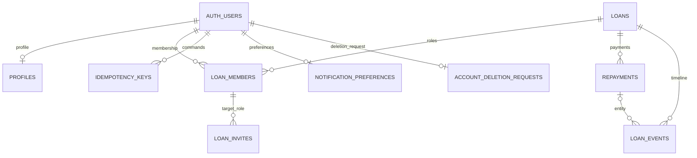

# Database LOAN — rà soát 21/09/2026

## Phạm vi và nguồn

Nguồn nghiệp vụ: `PHASE_0_PRODUCT_LOCK.md`, `KE_HOACH_THUC_THI.md`, các quyết định mới trong `BAO_CAO_TIEN_DO.md`. Nguồn triển khai: 15 migration trước ngày 21/09, `src/features/loans/api.ts`, `src/features/preferences/api.ts`, các RPC và bộ kiểm thử SQL.

Một khoản vay có hai vai trò LENDER/BORROWER; mỗi vai trò tối đa một thành viên, một người không giữ cả hai vai trò. Thành viên được mời có thể chưa có user_id. Chỉ repayment CONFIRMED giảm số dư; người tạo không được tự xác nhận. Link là capability, không ràng buộc email. Giao dịch tài chính dùng RPC atomic và idempotency key. Lịch sử tài chính không được xóa từ client. Chính sách sản phẩm về room sau xóa tài khoản còn mở; lượt này giữ nguyên cơ chế retention hiện có.

Supabase MCP và Context7 không có công cụ callable trong phiên làm việc. Chưa xác minh schema Cloud bằng MCP và chưa truy vấn Context7. Đã đọc skill Context7; dùng tài liệu chính thức dưới đây làm nguồn thay thế, không coi là đã hoàn thành hai bước MCP:

- [RLS, grants và index](https://supabase.com/docs/guides/database/postgres/row-level-security)
- [Liên kết auth.users](https://supabase.com/docs/guides/auth/managing-user-data)
- [Migration](https://supabase.com/docs/guides/deployment/database-migrations)
- [Seed](https://supabase.com/docs/guides/local-development/seeding-your-database)

## Bảng và kiểu dữ liệu

| Bảng | Primary key | Quan hệ và mục đích |
| --- | --- | --- |
| profiles | id UUID = auth.users.id | Hồ sơ; xóa theo tài khoản Auth |
| loans | id UUID | created_by → auth.users; principal_minor BIGINT, currency CHAR(3), loan_date/due_date DATE, status ENUM |
| loan_members | id UUID | loan_id → loans, user_id → auth.users; UNIQUE(loan_id, role), UNIQUE(loan_id, user_id) |
| loan_invites | id UUID | loan_id → loans, created_by → auth.users; (loan_id, target_role) → loan_members(loan_id, role); token_hash TEXT SHA256 |
| repayments | id UUID | loan_id → loans; created_by/confirmed_by/disputed_by → auth.users; amount_minor BIGINT, status ENUM |
| loan_events | id UUID | loan_id → loans, actor_id → auth.users; (loan_id, entity_id) → repayments(loan_id, id) khi có entity; metadata JSONB object |
| idempotency_keys | id UUID | user_id → auth.users; UNIQUE(user_id, command, key), key UUID; request_hash TEXT, response JSONB |
| account_deletion_requests | id UUID | user_id → auth.users, UNIQUE(user_id); trạng thái yêu cầu xóa |
| notification_preferences | user_id UUID | PK đồng thời FK auth.users; hai lựa chọn BOOLEAN |
| private.account_deletion_audit | id UUID | Audit riêng, former_user_id cố ý không có FK để giữ bản ghi sau khi user bị xóa |



Timestamp dùng TIMESTAMPTZ. Tiền dùng integer minor units > 0, giới hạn 9007199254740991 để client JavaScript không mất chính xác. Các enum, ngày đến hạn không trước ngày vay, giới hạn độ dài và trạng thái xác nhận/tranh chấp đã có trong migration cũ.

Migration mới giữ nguyên PK/FK hiện tại, thêm FK lời mời tới vai trò được mời và FK sự kiện tới repayment cùng khoản vay. Cặp entity_type/entity_id phải cùng rỗng hoặc là repayment hợp lệ, phù hợp toàn bộ RPC hiện tại. Muốn có loại entity khác phải có migration mới. Không áp đặt FK lên UUID lồng trong JSON receipt/metadata; quan hệ authoritative nằm ở các cột có FK.

## Index và updated_at

Đã bổ sung index cho các FK actor còn thiếu: loans.created_by, loan_invites.created_by, repayments.created_by/confirmed_by/disputed_by, loan_events.actor_id. Các FK khác được phủ bởi PK, UNIQUE hoặc index sẵn có. Hai FK ghép mới có index tương ứng.

Thêm loans(status, due_date), loans(created_at DESC) và GIN pg_trgm cho purpose. GIN phục vụ truy vấn SQL ILIKE trên purpose; giao diện hiện vẫn lọc danh sách trong client, nên không tuyên bố index này đã tăng tốc tìm kiếm trên UI.

Trigger BEFORE UPDATE dùng statement_timestamp(), search_path rỗng, áp dụng trên tám bảng mutable có updated_at. Với cột mới, hàng cũ nhận thời điểm migration; không suy diễn đó là thời điểm sửa lịch sử. loan_events và private.account_deletion_audit là audit, giữ created_at/processed_at, không thêm updated_at.

## RLS và ma trận quyền

RLS bật trên cả chín bảng public. Mỗi bảng có policy SELECT/INSERT/UPDATE/DELETE tường minh. Policy không tự cấp GRANT; quyền bảng và policy đều phải cho phép. SECURITY DEFINER RPC kiểm tra auth.uid(), membership, vai trò và trạng thái trước khi ghi.

| Nhóm | SELECT trực tiếp của authenticated | INSERT | UPDATE | DELETE |
| --- | --- | --- | --- | --- |
| profiles | Chính mình/người có khoản vay chung | Qua RPC/trigger | Policy chỉ chính mình, GRANT ghi vẫn đóng; dùng ensure_my_profile | Chặn, dùng quy trình xóa tài khoản |
| loans, loan_members, repayments, loan_events | Thành viên ACCEPTED | Qua RPC | Qua RPC | Chặn |
| loan_invites, idempotency_keys | Chặn, truy cập qua RPC phù hợp | Qua RPC | Qua RPC | Chặn |
| account_deletion_requests | Chính mình | Qua RPC | Qua quy trình xử lý | Chặn |
| notification_preferences | Policy chính mình; GRANT vẫn đóng, dùng RPC | Qua RPC | Qua RPC | Chặn |

Không thêm policy `using(true)` để mở sửa tài chính. Các policy false là mặc định chặn, không phải quyền CRUD rộng. Service-role/backend tin cậy không bị RLS ràng buộc; tuyệt đối không đưa key này vào app.

Đã phát hiện local có GRANT TRUNCATE/REFERENCES/TRIGGER trên profiles cho anon/authenticated. Migration thu hồi mọi quyền bảng profiles từ PUBLIC/anon/authenticated rồi cấp lại SELECT cho authenticated. TRUNCATE không được RLS bảo vệ; kiểm thử xác nhận quyền này đã bị gỡ.

## Migration và seed local, không reset

Migration do CLI tạo: `supabase/migrations/20260921001929_schema_completeness.sql`. Có transaction, lock_timeout 5 giây và statement_timeout 120 giây. Constraints được thêm NOT VALID rồi VALIDATE trong cùng transaction: nếu hàng cũ không hợp lệ thì migration thất bại và rollback, không sửa/xóa hàng để ép đạt. CREATE INDEX thường có thể chặn ghi; phải đánh giá kích thước/tải trước khi cho phép triển khai Cloud.

Từ thư mục `app`, sau khi Docker chạy:

```powershell
.\node_modules\.bin\supabase.cmd migration list --local
.\node_modules\.bin\supabase.cmd migration up --local
.\node_modules\.bin\supabase.cmd test db --local
```

Seed tự động vẫn tắt trong config.toml. Không chạy db reset. Seed có chốt opt-in và collision check UUID; không UPDATE/DELETE người dùng cũ. Hai user mẫu `loan-seed-lender@example.invalid` và `loan-seed-borrower@example.invalid` không có mật khẩu/identity đăng nhập. Chúng phục vụ kiểm tra SQL; muốn thử UI cần tài khoản Auth local riêng. Seed tạo giao dịch qua chính RPC nghiệp vụ, dùng UUID command key cố định để chạy lại không trùng.

```powershell
Get-Content -Raw supabase/seed.sql |
  docker exec -i -e 'PGOPTIONS=-c loan.allow_local_seed=on' supabase_db_loan-local `
    psql -X -U postgres -d postgres -v ON_ERROR_STOP=1
```

Chốt opt-in giúp tránh chạy nhầm, không thay thế xác minh target. Lệnh trên chỉ dùng container local có tên cố định; không dùng kết nối Cloud. Seed gồm khoản PENDING 500.000 VND và ACTIVE 1.000.000 VND đã xác nhận trả 200.000 VND, còn 800.000 VND. Không gửi email hoặc OTP.

## Kết quả và giới hạn

- Supabase CLI 2.115.0, PostgreSQL 17 local, 16 migration sau khi áp dụng.
- 5 SQL suites, 86 assertions PASS, gồm 66 kiểm tra nghiệp vụ trước đó và 20 kiểm tra schema/RLS mới.
- `supabase db lint --local --level error` không trả lỗi; `migration list --local` xác nhận đủ 16 phiên bản khớp lịch sử local.
- Dấu vân tay dữ liệu public trước/sau migration bằng nhau khi bỏ cột updated_at. File kiểm tra: `supabase/diagnostics/schema-data-fingerprint.sql`; kết quả local trong `.local/schema-data-before.txt` và `.local/schema-data-after.txt`.
- Seed chạy hai lần thành công; dấu vân tay và số hàng không đổi giữa hai lần. Không reset, truncate, drop bảng hoặc xóa dữ liệu tồn tại.
- Chưa kiểm tra Supabase Cloud qua MCP; chưa có truy vấn Context7; chưa triển khai Cloud. Cần kết nối hai MCP đó để hoàn thành đúng yêu cầu công cụ.
- Chỉ được deploy Cloud sau khi chủ dự án xác nhận; trước đó phải kiểm tra drift, quyền thực tế, dữ liệu vi phạm constraints, backup và lịch thực hiện index.
